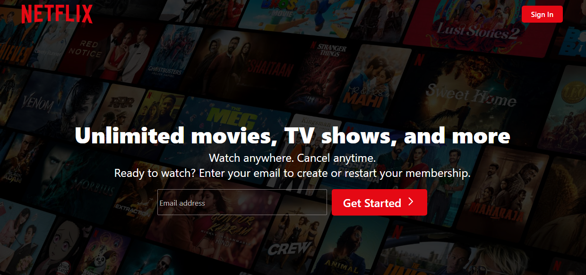
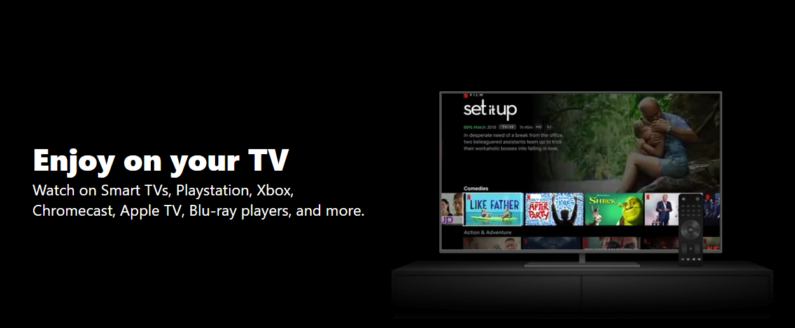
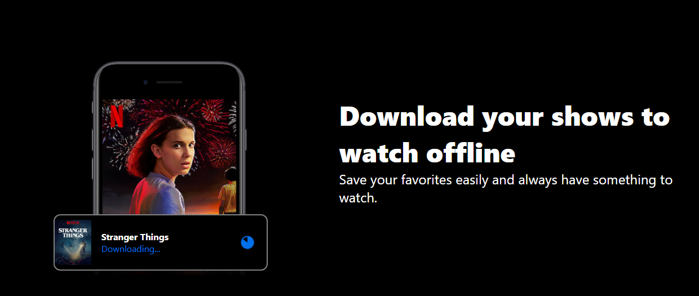
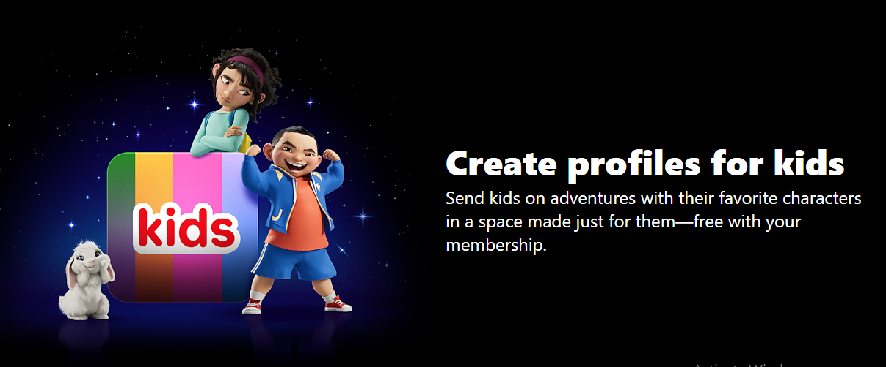
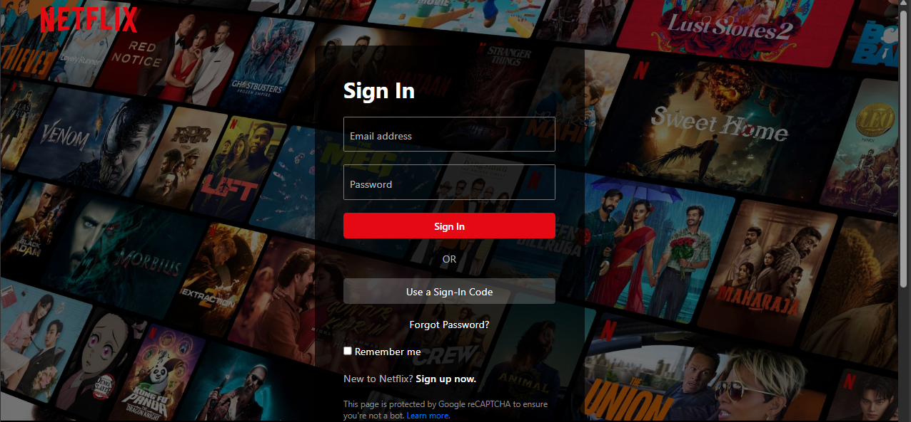

# Netflix Landing Page Clone

A responsive Netflix landing page clone built with HTML, CSS, and  JavaScript. This project replicates the Netflix homepage with modern design, and interactive elements.

## 🎯 Project Overview

This is a Netflix  landing page clone that features:
- **Responsive Design**: Works seamlessly on desktop, tablet, and mobile devices
- **Modern UI/UX**: Replicates Netflix's signature dark theme and typography
- **Interactive Elements**: Email signup forms, navigation, and hover effects
- **Multiple Pages**: Landing page, sign-in page, and sign-in code page
- **Smooth Animations**: CSS and transitions for enhanced user experience

## 🚀 Features

### Main Landing Page (`index.html`)
- Netflix logo and navigation
- Hero section with email signup
- Multiple content sections showcasing Netflix features:
  - TV streaming capabilities
  - Mobile download functionality
  - Kids profile creation
  - Cross-device streaming
- Footer with links and language selector

### Sign-in Page (`signin.html`)
- User authentication form
- Email and password inputs
- Remember me functionality
- Alternative sign-in methods
- Responsive design

### Sign-in Code Page (`signincode.html`)
- Code-based authentication
- Alternative login method

## 📁 Project Structure

```
netflix-landing-page-main/
├── index.html          # Main landing page
├── signin.html         # Sign-in page
├── signincode.html     # Sign-in code page
├── style.css           # Main stylesheet
├── logo.svg            # Netflix logo
├── favicon.ico         # Website favicon
├── bg.jpg              # Background image
├── mobilebg.jpg        # Mobile background
├── tv.png              # TV image
├── card.png            # Download card
├── kids.png            # Kids section image
├── video-tv.m4v        # TV video animation
└── Pics/               # Screenshots folder
    ├── 1.png
    ├── 2.png
    ├── 3.png
    ├── 4.png
    └── 5.png
```

## 🛠️ How to Run

### Prerequisites
- A modern web browser (Chrome, Firefox, Safari, Edge)
- No additional dependencies required

### Running the Project

1. **Clone or Download the Project**
   ```bash
   # If you have Git installed
   git clone https://github.com/UmairZakria/netflix-landing-page
   
   # Or simply download and extract the ZIP file
   ```

2. **Open the Project**
   - Navigate to the project folder
   - Double-click on `index.html` to open in your default browser
   
   **OR**
   
   - Right-click on `index.html`
   - Select "Open with" → Choose your preferred browser

3. **Alternative Method (Using Local Server)**
   ```bash
   # Using Python (if installed)
   python -m http.server 8000
   
   # Using Node.js (if installed)
   npx serve .
   
   # Using PHP (if installed)
   php -S localhost:8000
   ```
   Then open `http://localhost:8000` in your browser

## 📱 Screenshots

### Main Landing Page










## 🎨 Design Features

- **Dark Theme**: Netflix's signature dark color scheme
- **Typography**: Custom fonts matching Netflix's design
- **Animations**: Smooth hover effects and transitions
- **Responsive Layout**: Flexbox and CSS Grid for modern layouts
- **Interactive Forms**: Floating labels and validation
- **Video Integration**: Background video animations

## 🔧 Technologies Used

- **HTML5**: Semantic markup and structure
- **CSS3**: Modern styling with Flexbox and Grid
- **JavaScript**: Minimal interactivity
- **SVG Graphics**: Scalable vector graphics for logos
- **MP4 Video**: Background video animations

## 📱 Browser Compatibility

- ✅ Chrome (Recommended)
- ✅ Firefox
- ✅ Safari
- ✅ Edge
- ✅ Mobile browsers

## 🚀 Performance

- Optimized images and assets
- Minimal JavaScript for fast loading
- Responsive design for all screen sizes
- Efficient CSS animations

## 📄 License

This project is for educational purposes only. Netflix is a registered trademark of Netflix, Inc.

## 🤝 Contributing

Feel free to fork this project and submit pull requests for improvements!

## 📞 Support

If you encounter any issues or have questions, please open an issue in the repository.

---

**Note**: This is a clone project created for educational purposes. All Netflix branding and content belong to Netflix, Inc. 